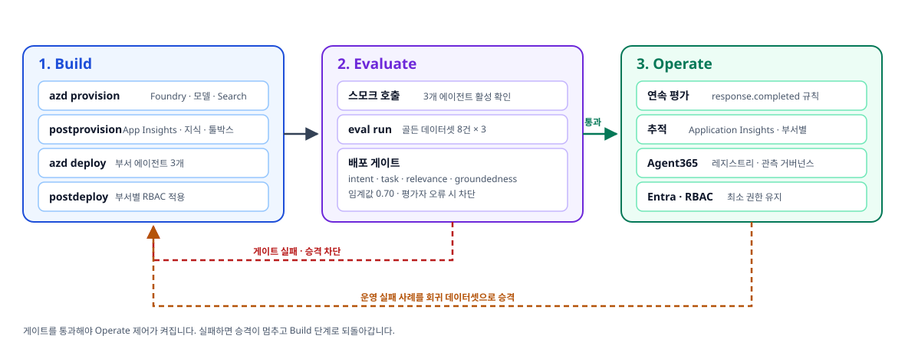
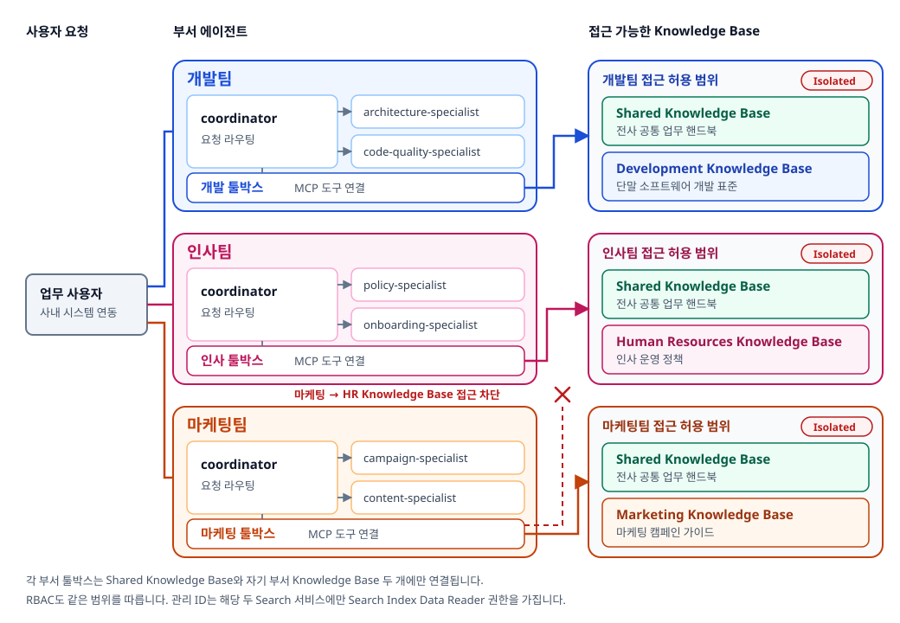
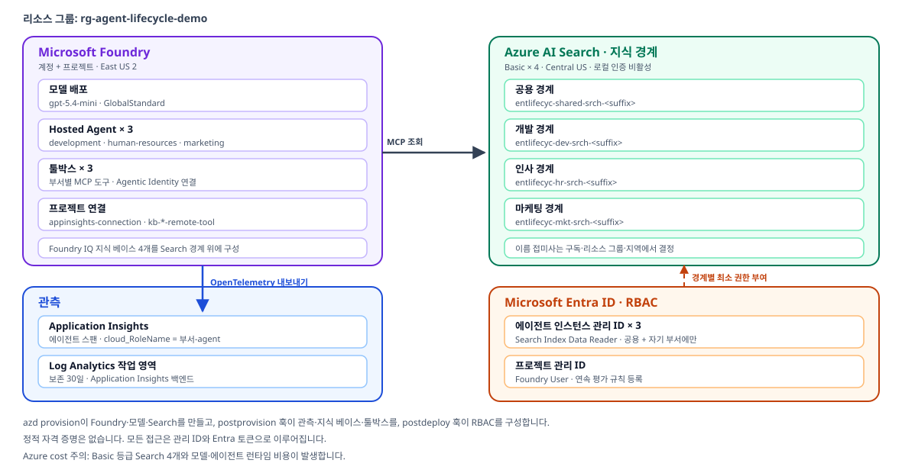

# Enterprise Agent Lifecycle on Azure Foundry

Microsoft Foundry Hosted Agents로 **부서별로 격리된 엔터프라이즈 에이전트**를
Build → Evaluate → Operate 순서로 운영하는 참조 구현입니다.

이 저장소의 지식 문서와 평가 데이터셋은 **가상의 엔터프라이즈 시나리오**입니다.
스마트폰 제조와 이동통신 서비스를 함께 운영하는 가상 기업을 가정하고, 개발팀 · 인사팀 · 마케팅팀
세 조직이 각자의 지식만 조회하는 상황을 다룹니다. 실제 조직이나 제품과는 무관하며,
자기 도메인 데이터로 교체해서 사용하도록 만든 예시입니다.

## 핵심 원칙

| 원칙 | 구현 |
| --- | --- |
| 부서 격리 | 각 부서 에이전트는 **공용 + 자기 부서** 지식만 조회. 타 부서 요청은 근거 없음으로 응답 |
| 최소 권한 | 에이전트 관리 ID에 `Search Index Data Reader`만, 허용된 범위(scope)에만 부여 |
| 자격 증명 비저장 | 관리 ID와 `DefaultAzureCredential`만 사용. 키·토큰을 소스·프롬프트·로그에 두지 않음 |
| 게이트 우선 | 평가 게이트를 통과해야 Operate 제어가 활성화 |

---

## 아키텍처 1. 라이프사이클 단계

Build에서 만든 것을 Evaluate가 검증하고, 통과한 뒤에만 Operate 제어가 켜집니다.
게이트가 실패하면 승격이 멈추고, 운영 중 발견된 실패 사례는 회귀 데이터셋으로 되돌아갑니다.



[Open full-size lifecycle SVG](docs/architecture/agent-lifecycle-workflow.svg)


---

## 아키텍처 2. 3개 팀 시나리오

각 부서는 coordinator 1개와 specialist 2개로 구성되고, 자기 부서 툴박스를 통해서만 지식에 접근합니다.
툴박스는 **공용 경계 + 자기 부서 경계** 두 개만 연결하므로 교차 조회가 구조적으로 차단됩니다.



[Legacy Excalidraw sketch](docs/architecture/enterprise-agent-lifecycle.excalidraw)

---

## 아키텍처 3. Azure 리소스

| 리소스 | 역할 |
| --- | --- |
| Foundry 계정 · 프로젝트 | Hosted Agent 실행과 모델 배포(`gpt-5.4-mini`) |
| Azure AI Search × 4 | 공용 1 + 부서 3. **Foundry IQ** 지식 베이스의 보안 경계 |
| Foundry 툴박스 × 3 | 부서별 MCP 도구 묶음. 연결은 Agentic Identity 사용 |
| Application Insights + Log Analytics | 에이전트 추적. 프로젝트 연결로 Foundry 포털에 노출 |
| Entra · RBAC | 에이전트 관리 ID별 최소 권한 부여 |



[Open full-size Azure resource SVG](docs/architecture/azure-resource-architecture.svg)


---

## 저장소 구조

```text
agent.py                     Hosted Agent 진입점
azure.yaml                   azd 서비스·훅 정의 (infra provider: bicep)
departments.yaml             부서·specialist 정의 (단일 진실 공급원)
knowledge/                   색인 대상 지식 문서 (공용 + 부서 3개)
evals/                       평가 설정과 골든 데이터셋
deploy/infra/                Bicep 템플릿
deploy/hooks/                azd 라이프사이클 훅
deploy/toolboxes/            부서별 툴박스 정의
src/lifecycle_agent/         에이전트 런타임 (coordinator + specialist)
src/lifecycle_ops/           프로비저닝·평가·운영 자동화
```

## 로컬 준비

`azd` 1.31.1 이상이 필요합니다. CI도 같은 버전으로 고정되어 있으므로 로컬과 파이프라인이
동일한 명령 표면을 사용합니다.

```powershell
azd version
uv --version
uv venv --python 3.13
uv pip install --prerelease=allow -r requirements-dev.txt
pre-commit install
pre-commit run --all-files
```

에이전트를 로컬에서 실행하려면 환경 변수를 설정한 뒤 `python agent.py`를 실행합니다.

| 변수 | 설명 |
| --- | --- |
| `DEPARTMENT` | `development` · `human-resources` · `marketing` |
| `FOUNDRY_PROJECT_ENDPOINT` | Foundry 프로젝트 엔드포인트 |
| `AZURE_AI_MODEL_DEPLOYMENT_NAME` | 모델 배포 이름 |
| `TOOLBOX_ENDPOINT` | 부서 툴박스 MCP 엔드포인트 |
| `APPLICATIONINSIGHTS_CONNECTION_STRING` | 추적 전송 대상 |

## 1. Build

```powershell
azd env set AZURE_SEARCH_LOCATION centralus
azd provision --no-prompt
azd deploy --no-prompt
```

`postprovision` 훅이 Application Insights, Foundry IQ 지식 베이스, 부서 툴박스를 만들고
`postdeploy` 훅이 부서별 RBAC를 적용합니다. 훅이 담당하므로 개별 명령을 직접 실행할 필요가 없습니다.

## 2. Evaluate

```powershell
azd ai agent eval run --config evals/eval.yaml --no-prompt
azd ai agent eval show --out-file artifacts/eval-development-results.json
python -m lifecycle_ops.evaluation.gate --config evals/eval.yaml --results artifacts/eval-development-results.json --output artifacts/eval-gate.json
```

인사팀과 마케팅팀은 `evals/human-resources.yaml`, `evals/marketing.yaml`로 동일하게 실행합니다.
게이트는 intent resolution · task adherence · relevance · groundedness 네 지표의 통과율을
임계값 `0.70`과 비교하고, 평가자 오류가 있으면 차단합니다.

## 3. Operate

```powershell
python -m lifecycle_ops.provisioning.continuous_eval
python -m lifecycle_ops.operations.agent365.readiness
python -m lifecycle_ops.operations.agent365.registry
```

연속 평가 규칙은 `response.completed` 이벤트로 동작하며 시간당 실행 수를 제한합니다.
Agent365 단계는 테넌트·라이선스 조건을 만족하지 않으면 `prerequisite-skipped`를 반환하는 정상 상태입니다.

## 관측

Foundry 포털의 각 에이전트 **Monitor** 탭에서 추적과 평가 결과를 확인합니다.
모든 스팬은 `OTEL_SERVICE_NAME`으로 `<부서>-agent`가 지정되어 `cloud_RoleName`으로 구분됩니다.

```kusto
union dependencies, requests, traces
| where timestamp > ago(1h)
| summarize events = count(), lastSeen = max(timestamp) by itemType, cloud_RoleName
| order by events desc
```

## 보안

- Entra ID 기반 인증만 사용하고 Search는 로컬 인증을 비활성화합니다.
- 부서 에이전트는 공용 경계와 자기 부서 경계에만 `Search Index Data Reader`를 가집니다.
- 사용자 위임 접근이 필요하면 툴박스 OAuth 패스스루(OBO)를 사용합니다. 상세는
  [docs/identity-and-access.md](docs/identity-and-access.md)를 참고하세요.
- 정적 자격 증명을 소스·프롬프트·로그·에이전트 캐시에 저장하지 않습니다.

## Search name migration

고정 이름을 쓰던 이전 환경에서 넘어오는 경우, 프로비저닝은 기존 서비스를 갱신하지 않고
접미사가 붙은 **creates replacement Search services**를 새로 만듭니다. 계정 이름 규칙도 달라지므로
이전 리소스는 그대로 남아 함께 과금됩니다.

순서를 지키세요.

1. `azd provision`으로 새 이름의 Search 서비스와 Foundry 계정을 만듭니다.
2. 지식 베이스와 툴박스 연결이 새 엔드포인트를 가리키는지 확인하고, 세 부서에서
   **all three evaluation gates pass** 상태를 확인합니다.
3. 검증이 끝난 뒤에만 이전 리소스를 삭제합니다.

```powershell
az search service delete --name <old-search-name> --resource-group <resource-group> --yes
```

Do not delete the fixed-name services before verification. 검증 전에 삭제하면 지식 베이스와
툴박스 연결이 끊겨 에이전트가 조회에 실패합니다.

## Teardown

Azure cost 주의: 이 구성은 Basic 등급 Search 4개와 모델·에이전트 런타임 비용을 발생시킵니다.
검증이 끝나면 리소스를 정리하세요.

```powershell
azd down --purge --force --no-prompt
```

## 문서

| 문서 | 내용 |
| --- | --- |
| [docs/operations.md](docs/operations.md) | 추적, 연속 평가, 롤백, teardown 런북 |
| [docs/identity-and-access.md](docs/identity-and-access.md) | 툴박스 권한 경계와 OBO 확장 |
| [AGENTS.md](AGENTS.md) | 저장소 작업 규칙 |
