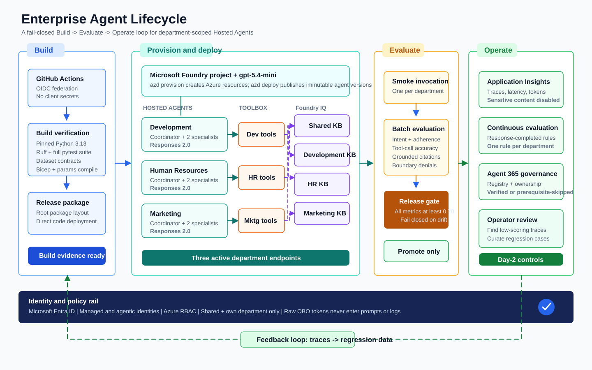
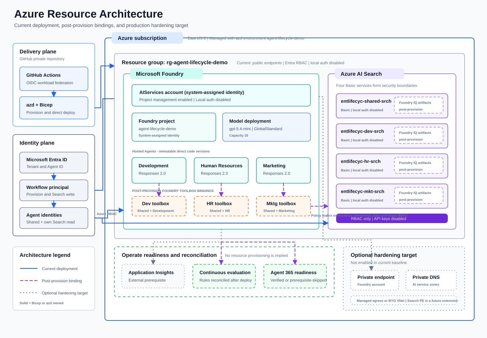

# Enterprise Agent Lifecycle on Azure Foundry

This repository provides an enterprise lifecycle baseline for three department-scoped hosted agents on Azure Foundry, with deterministic Build, Evaluate, and Operate controls, strict knowledge boundaries, and least-privilege identity enforcement.

[](docs/architecture/agent-lifecycle-workflow.svg)

[Open full-size lifecycle SVG](docs/architecture/agent-lifecycle-workflow.svg) | [Legacy Excalidraw sketch](docs/architecture/enterprise-agent-lifecycle.excalidraw)

## Architecture focus: Build -> Evaluate -> Operate

- Build: GitHub OIDC build and deploy pipeline uses federated identity with no static secret requirement.
- Evaluate: Evaluation is an explicit gate before operate promotion using `eval.yaml` and `scripts/validate_eval_results.py`.
- Operate: App Insights telemetry, continuous evaluation rules, and Agent365 governance verification are tracked as day-2 controls.

## Azure resource architecture

[](docs/architecture/azure-resource-architecture.svg)

[Open full-size Azure resource SVG](docs/architecture/azure-resource-architecture.svg)

Solid paths are provisioned by Bicep or `azd`; dashed paths are post-provision bindings; dotted paths are external prerequisites or optional hardening that are not active resources in the current baseline. The current deployment uses public endpoints protected by Microsoft Entra ID and Azure RBAC, with local authentication disabled. The target-state boundary identifies Foundry private networking and the additional Search private endpoint work required for a production-isolated deployment.

## Departmental multiagent and boundary model

- The deployment workflow targets three hosted department agents: development, human-resources, and marketing.
- Each department agent follows a coordinator + 2 specialist collaboration pattern.
- Each department gets one dedicated toolbox, plus access to only allowed boundaries.
- Foundry IQ boundaries are four separate search-backed knowledge bases:
  - shared
  - development
  - human-resources
  - marketing
- `scripts/set_agent_rbac.py` enforces Entra and RBAC least privilege by granting search reader rights only to shared + same-department boundaries.

## Identity, RBAC, and OBO decision

- Entra and RBAC are enforced for hosted agents, toolboxes, and search boundaries.
- The quickstart boundary path is Agentic Identity (`https://search.azure.com`) and does not require user token passthrough.
- OBO decision: OBO is intentionally reserved for future ACL-aware MCP data sources where delegated caller identity must flow to downstream APIs.

## Prerequisites

- Python 3.13 runtime target and local Python environment.
- `azd` installed, with Foundry extension support (`azd extension install microsoft.foundry --no-prompt`).
- Azure subscription with quota for Foundry project and model deployment.
- Preview and tenant prerequisites for Agent365 governance and Graph-based role operations.
- Required environment values (example in `.env.example`):
  - `DEPARTMENT`
  - `FOUNDRY_PROJECT_ENDPOINT`
  - `AZURE_AI_MODEL_DEPLOYMENT_NAME`
  - `TOOLBOX_ENDPOINT`

## Cost and security notes

- Azure cost warning: this baseline provisions four Basic Search boundaries plus model/agent runtime costs; monitor spend before scale-up.
- Agent365 may report `prerequisite-skipped` when tenant/license/admin prerequisites are not met; this is an expected conditional state.
- No secrets policy: do not place static credentials in source, prompts, or tool payloads.

## Local setup

```powershell
python -m venv .venv
.\.venv\Scripts\Activate.ps1
python -m pip install --upgrade pip
pip install -r requirements.txt
```

## Local department run

```powershell
$env:FOUNDRY_PROJECT_ENDPOINT = "https://your-foundry-project.services.ai.azure.com/api/projects/your-project"
$env:AZURE_AI_MODEL_DEPLOYMENT_NAME = "gpt-5.4-mini"
$env:TOOLBOX_ENDPOINT = "https://your-toolbox-endpoint"

$env:DEPARTMENT = "development"
python services/agents/development/main.py

$env:DEPARTMENT = "human-resources"
python services/agents/human-resources/main.py

$env:DEPARTMENT = "marketing"
python services/agents/marketing/main.py
```

## Provision and deploy

```bash
azd extension install microsoft.foundry --no-prompt
azd provision --no-prompt
mkdir -p artifacts
python scripts/provision_knowledge_bases.py --output artifacts/knowledge-bases.json
pwsh -File scripts/configure_toolboxes.ps1
azd deploy --no-prompt
python scripts/set_agent_rbac.py --report-path artifacts/rbac.json
```

## Evaluate gate

```bash
azd ai agent eval run --config eval.yaml --no-prompt --output json > artifacts/eval-results.json
python scripts/validate_eval_results.py --config eval.yaml --results artifacts/eval-results.json --output artifacts/eval-gate.json
```

## Operate controls

```bash
python scripts/configure_continuous_evaluation.py
python scripts/agent365/configure_observability.py
python scripts/agent365/verify_registry.py
```

## Teardown

```bash
azd down --purge --force --no-prompt
```
